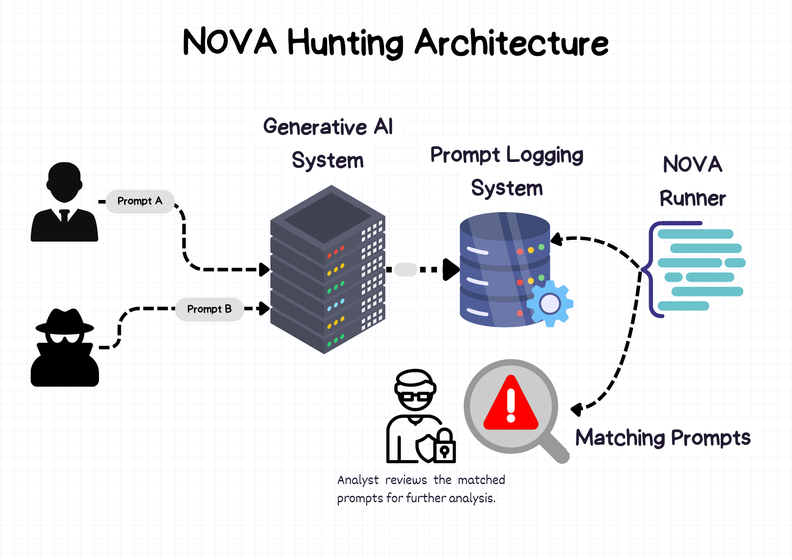

---
hide:
  - usecases
icon: material/briefcase-search
title: Architecture
---

# Monitoring and Hunting with NOVA on AI Systems

NOVA provides powerful capabilities for monitoring and hunting across your AI systems by deploying rules to your architecture that analyze prompt telemetry.

!!! info
    Multiple logging systems exist to allow you to log the prompts from your user. 

## Implementation Methods

There are multiple ways to integrate NOVA with your existing AI infrastructure:

### 1. Public Service Log Analysis
The simplest approach for organizations using public services like Anthropic, OpenAI, Ollama or similar providers is to export logs and run NOVA directly on these exported datasets. This requires minimal integration effort and provide you all the prompts.

### 2. Client-Side Logging
If you have built a system that interfaces with various AI models, implement logging on your side to capture prompts before they are sent to external API endpoints. This gives you control over what is captured and allows for consistent analysis across different providers.

### 3. Direct Integration
Connect NOVA directly to your custom-built AI systems or existing logging infrastructure. This approach offers the deepest integration and can enable more sophisticated monitoring capabilities.

